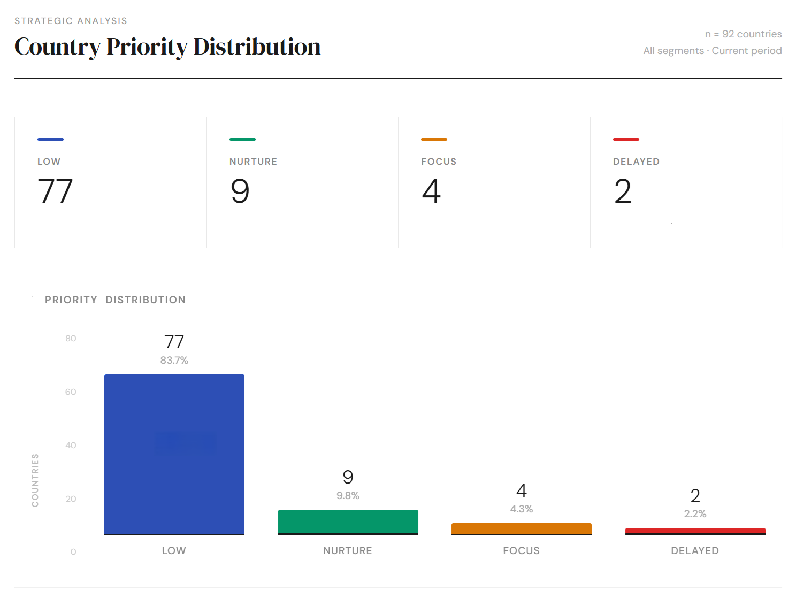

# Institutional AI Readiness Model  
Rule-Based Configurational Approach to National AI Commitment  

# Government AI Pipeline Case Study

## Overview

Public-sector AI sales cycles are long, resource-intensive, and structurally uneven. Most national markets show surface-level interest in AI adoption but lack the institutional conditions required to move from engagement to strategic commitment.

Without a framework to distinguish structurally viable opportunities from those that will stall regardless of effort, pipeline resources get misallocated at scale.

This model formalizes institutional signals observed across public-sector AI engagements into a transparent, rule-based classification system that explains why countries progress — or don't.

The focus is institutional feasibility rather than market demand or predictive modeling.

---

## Objective

What institutional conditions are necessary for a country to reach strategic commitment in national-level AI programs?  

To design a rule-based analytical framework that evaluates country-level AI readiness and supports prioritization of opportunities in public-sector AI contexts.

---

## Country Priority Distribution

The distribution is heavily skewed toward the Low priority segment:

- 77 countries (~84%) fall into Low Priority  
- 9 countries are classified as Nurture  
- 4 countries reach Focus  
- 2 countries are Delayed  

This indicates a structurally imbalanced pipeline where most countries do not meet the institutional conditions required for progression.

---

## Conceptual Framework

The model follows a configurational logic rather than additive scoring.

Strategic commitment is not treated as a cumulative index.  
Instead, it emerges only when specific institutional conditions are jointly satisfied.

The framework operationalizes three core dimensions:

- SA (Senior Access) — access to senior decision-makers  
- STR (Formal Strategy) — existence of a national AI strategy  
- EX (Execution Capacity) — ability to operationalize AI initiatives  

Execution capacity is derived from:

- Budget_Signal — presence of funding commitment  
- Blocking_Constraint — presence of structural barriers  

Execution capacity:
EX = 1 if Budget_Signal = 1 AND Blocking_Constraint = 0
Else EX = 0

---

## Dataset

The dataset contains structured information about public-sector engagement activity across multiple countries.

Main fields:

- country  
- stage (outreach, engagement, meeting, proposal, won)  
- stage_order  
- won  
- is_closed  

Files:

- `data/clean_dataset.csv`  
- `data/country_rules.csv`  

---

## Methodology

### 1. Data aggregation (SQL layer)

Lead-level data is aggregated to country-level metrics:

- total leads  
- stage distribution  
- max stage reached  
- final-stage counts  

Implemented in:

- `sql/01_country_priority_base.sql`

---

### 2. Rule-based readiness model

Institutional signals are translated into analytical variables:

- SA  
- STR  
- Budget_Signal  
- Blocking_Constraint  

Classification logic:

- Level 1 → SA = 0  
- Level 2 → SA = 1 AND (STR = 0 OR EX = 0)  
- Level 3 → SA = 1 AND STR = 1 AND EX = 1  

Priority mapping:

- Blocking_Constraint = 1 → Delayed  
- Level 3 → Focus  
- Level 2 → Nurture  
- Else → Low Priority  

---

## SQL Analytical Layer

All analytical logic is implemented in SQL.

### Priority Volume

- `sql/02_priority_volume.sql`  
Distribution of countries and leads by priority

### Pipeline Depth

- `sql/03_priority_stage_depth.sql`  
Average and maximum progression by priority

### Conversion

- `sql/04_priority_conversion.sql`  
final_stage_rate = won_count / total_leads

Important:
"won" represents reaching the final stage, not necessarily a closed deal.

### Validation

- `sql/05_validation_checks.sql`  

Ensures:

- no missing country mappings  
- no null rule inputs  
- no duplicate rule entries  
- classification consistency  

---

## Model Transparency

### Truth Table

- `sql/06_truth_table.sql`

Enumerates all possible combinations of institutional conditions and resulting levels.  
Ensures full logical coverage of the model.

---

### Counterfactual Analysis

- `sql/07_counterfactuals.sql`

Evaluates how outcomes change under alternative scenarios:

- removing blocking constraints  
- enabling budget signals  
- combined adjustments  

Findings:

- SA is a hard constraint  
- Budget is required for execution  
- Removing constraints alone is insufficient without funding  

Strategic commitment requires joint institutional alignment.

---

## Pipeline Priority Analysis

### Progression

- Focus → highest progression  
- Nurture → moderate  
- Delayed / Low → early stagnation  

---

### Volume

- Focus and Nurture dominate pipeline volume  
- Delayed remains significant → inefficiency signal  

---

### Interpretation

- Focus → viable strategic targets  
- Nurture → development potential  
- Delayed → structurally blocked  
- Low Priority → non-viable  

Pipeline inefficiency is structural, not random.

---

## Key Insight

- ~84% of countries fall into Low Priority  
- These generate minimal progression  
- Meaningful outcomes are concentrated in a small subset  

This reflects systemic misallocation of effort.

---

## Methodological Positioning

This is not a predictive ML model.

It:

- uses rule-based necessary-condition logic  
- is fully transparent  
- is interpretable  
- supports structural diagnostics  

Closer to institutional analysis and QCA than to scoring models.

---

## Repository Structure

- `data/` — input datasets  
- `sql/` — analytical layer  
- `outputs/` — charts  
- `README.md` — documentation  

---

## Tech Stack

- PostgreSQL — analytical logic  
- SQL — modeling and analysis  
- Excel — initial structuring  
- GitHub — documentation  

---

## Data Note

The dataset is an analytical reconstruction based on generalized patterns observed across public-sector engagements.

It is anonymized and does not represent any specific organization’s operational pipeline.
