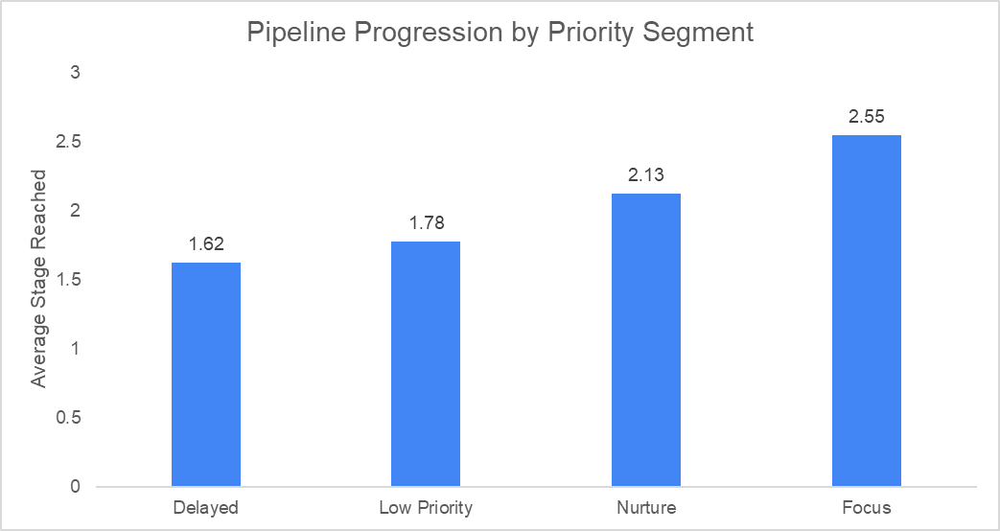
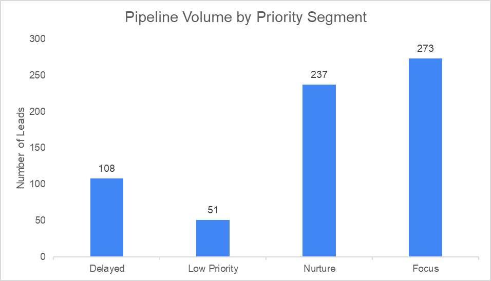

## Priority-Based Pipeline Analysis

This analysis presents a segmentation of the government AI pipeline based on a rule-based institutional readiness model.

The model uses four binary signals:

- `sa`
- `str`
- `budget_signal`
- `blocking_constraint`

Execution capacity (`ex`) and institutional level are derived using deterministic rules implemented in SQL.

Countries are then grouped into business priority segments:

- Focus
- Nurture
- Delayed
- Low Priority

The full analytical logic is implemented in the SQL layer (`/sql` folder), including:
- classification model
- validation checks
- full truth table of the model
- counterfactual scenario analysis

---

### Pipeline Progression by Priority

This chart shows the **average stage reached** for each priority segment.

Key observation:
- Focus countries progress significantly further in the pipeline
- Delayed and Low Priority segments stall early
- Nurture sits in between, confirming partial readiness

---

### Pipeline Volume by Priority Segment

This chart shows the **distribution of leads** across priority segments.

Key observation:
- A large portion of the pipeline is concentrated in Focus and Nurture
- However, a substantial share remains in Delayed, indicating structural inefficiencies

---

### Interpretation

The combination of progression and volume reveals a structural pattern:

- Focus → high progression + high volume → core strategic targets  
- Nurture → moderate progression + high volume → development potential  
- Delayed → low progression despite volume → blocked by constraints  
- Low Priority → low progression + low volume → deprioritized  

This confirms that pipeline inefficiency is not random, but structurally driven by institutional conditions.
